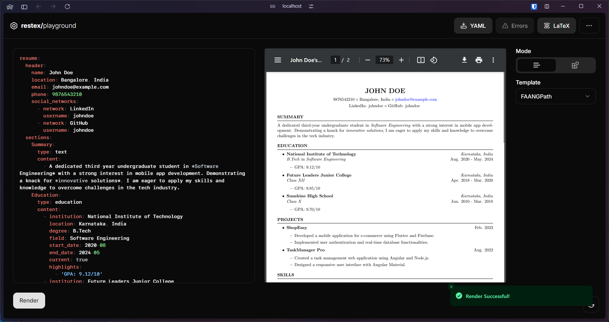

                         
<br/>
<div align="center">
<a href="https://github.com/abhiroopc84/restex">

</a>
<h3 align="center">restex</h3>
<p align="center">
A form based resume generator with a $\LaTeX$ resume generator framework.

<br/>
<br/>
<a href="https://github.com/abhiroopc84/restex">View Demo .</a>  
<a href="https://github.com/abhiroopc84/restex/issues/new?labels=bug&template=bug-report---.md">Report Bug .</a>
<a href="https://github.com/abhiroopc84/restex/issues/new?labels=enhancement&template=feature-request---.md">Request Feature</a>
</p>
</div>

 ## About The Project



There are many great resume generators out there, however, I didn't find one that really boils down the simplicity and the reason for that is because I believe your time should be focused on the resume content and on the design of it, but both of these should be addressed seperately.

Of course, no one template will serve everyone since your resume content and sections may be vastly different. So I'll be adding more in the near future. You may also suggest changes by forking this repo and creating a pull request or opening an issue.

 ### Built With

- [React](https://reactjs.org)
- [shadcn/ui](https://ui.shadcn.com/)
- [dnd-kit](https://dndkit.com/)
- [RadixUI](https://www.radix-ui.com/)
- [Tailwind](https://tailwindcss.com/)

 <!-- ## Getting Started

To get a local copy up and running follow these simple steps.
1. Clone the repository to your local system.
2. Install packages required.
   ```bash
   npm i
   ``` -->

 <!-- ### Installation

_Below is an example of how you can instruct your audience on installing and setting up your app. This template doesn't rely on any external dependencies or services._

1. Get a free API Key at [https://example.com](https://example.com)
2. Clone the repo
   ```sh
   git clone https://github.com/your_username_/Project-Name.git
   ```
3. Install NPM packages
   ```sh
   npm install
   ```
4. Enter your API in `config.js`
   ```js
   const API_KEY = "ENTER YOUR API";
   ``` -->
 ## Usage

Text-mode:


<!-- _For more examples, please refer to the [Documentation](https://example.com)_ -->
 ## Roadmap
- [x] Basic markdown support
- [ ] Switch PDF compilation fromo swiftlatex to texlive.js
- [ ] Full markdown support
- [ ] Fully typed functions
- [ ] Add new templates

See the [open issues](https://github.com/abhiroopc84/restex/issues) for a full list of proposed features (and known issues).
 ## Contributing

Contributions are what make the open source community such an amazing place to learn, inspire, and create. Any contributions you make are **greatly appreciated**.

If you have a suggestion that would make this better, please fork the repo and create a pull request. You can also simply open an issue with the tag "enhancement".
Don't forget to give the project a star! Thanks again!

1. Fork the Project
2. Create your Feature Branch (`git checkout -b feature/AmazingFeature`)
3. Commit your Changes (`git commit -m 'Add some AmazingFeature'`)
4. Push to the Branch (`git push origin feature/AmazingFeature`)
5. Open a Pull Request
 ## License

Distributed under the MIT License. See [MIT License](https://opensource.org/licenses/MIT) for more information.
 ## Contact

Your Name - [@me_abhiroop](https://x.com/me_abhiroop) - abhiroopc84@gmail.com

Project Link: [https://github.com/abhiroopc84/restex](https://github.com/abhiroopc84/restex)
 ## Acknowledgments

- [RenderCV](https://github.com/sinaatalay/rendercv)
